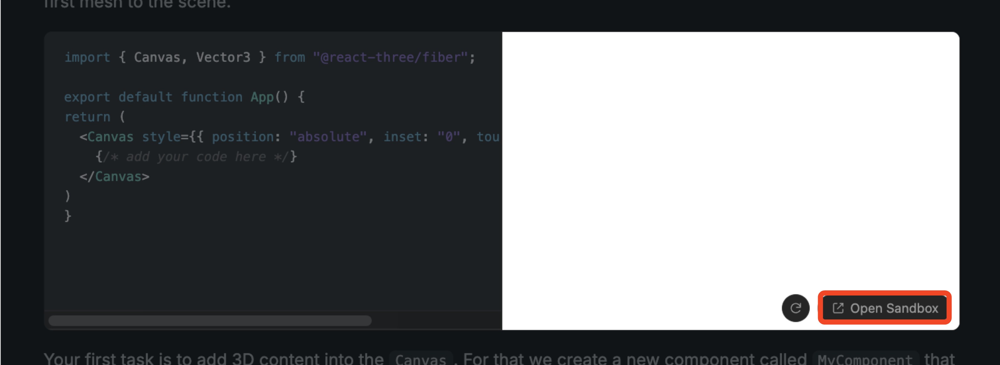

For this workshop we offer you to either develop in a for-each part pre-configured Codesandbox or clone a github repository and develop locally.

> [!NOTE]
> If you prefer programming in your local development environment, clone ``.

If you prefer in pre-configured Codesandbox, you can use the `Open Sandbox` to get the current base configuration into a brand new Codesandbox.

Therefore, the Codesandbox on the next page always shows the solution for the current step.

In the next step, we'll directly begin building our first React Three Fiber app. Please follow the link on the bottom right to continue.