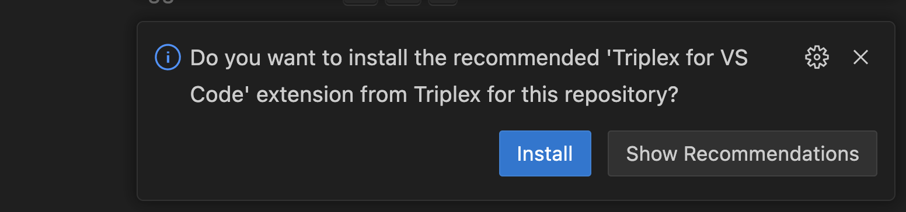
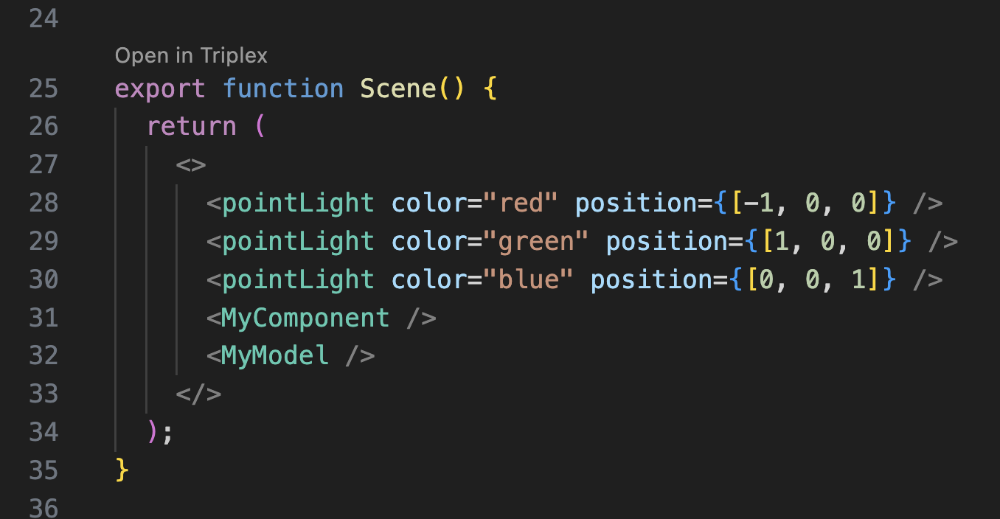
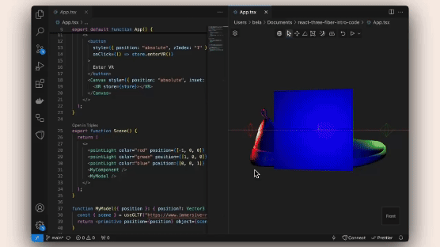

Now that we have moving objects and 3D models we can start to think about scene composition. Placing objects in a scene can be tedious work.

Using the VSCode plugin `triplex`, we modify our scene in 3D by dragging the objects. All changes get saves back to code after modifying.

Let's try out triplex on our current scene by cloning the current code to your local machine using

```batch
git clone https://github.com/bbohlender/react-three-fiber-intro-code
```

Next we open the code in vscode and install the dependencies with `npm install`.

After a short period, the recommendation to install triplex should showup on the bottom right.



Now we can open exported react component in triplex through VSCode by click `Open in Triplex` above each component.



We can open up the scene to modify the composition of the elements including the lights by dragging them with the move tool and duplicate objects.



After our visual modifications we can hit save to write our changes to our code. 