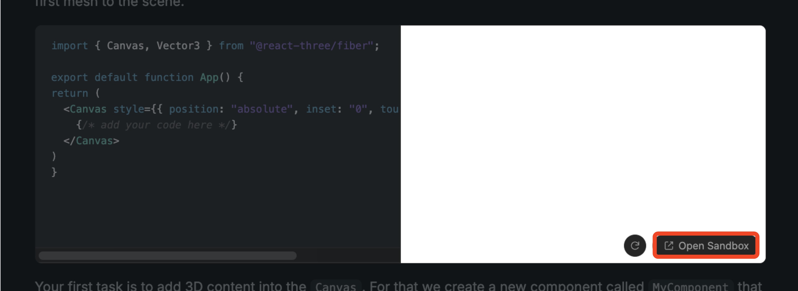
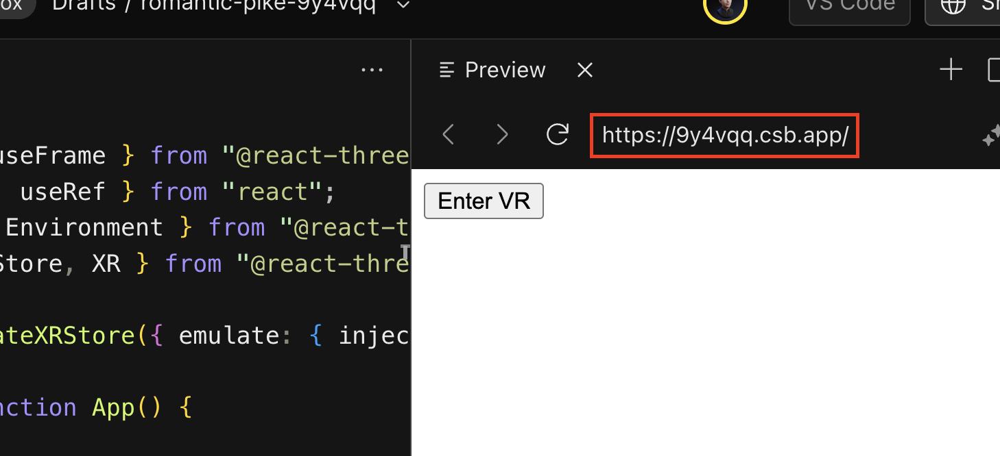

To test our application on the Meta Quest 3s we need to turn our code into a codesandbox, allowing us to access the code from our headset.

<Sandpack codeViewer
  template="react-ts"
  customSetup={{
    dependencies: {
      'three': '~0.168.0',
      '@react-three/fiber': 'latest',
      '@react-three/drei': 'latest',
      '@react-three/xr': 'latest',
      'zustand': 'latest',
      'gsap': 'latest',
      '@react-three/uikit': 'latest',
      '@react-three/uikit-default': 'latest'
    },
  }}
  files={{
    '/App.tsx': `import { Canvas, useFrame } from "@react-three/fiber";
import { useState, useRef } from "react";
import { useGLTF, Environment } from "@react-three/drei";
import { createXRStore, XR } from "@react-three/xr";
import { Mesh } from "three";

const store = createXRStore();

export default function App() {
  return (<>
    <button style={{ position: "absolute", zIndex: "1" }} onClick={() => store.enterVR()}>
        Enter VR
    </button>
    <Canvas style={{ position: "absolute", inset: "0", touchAction: "none" }}>
      <XR store={store}>
        <Environment preset="warehouse" />
        <MyComponent />
        <MyModel />
      </XR>
    </Canvas>
    </>
  )
}

function MyModel() {
    const { scene } = useGLTF("https://www.immersive-react.com/shoe.glb")
    return <primitive object={scene} />
}

function MyComponent() {
    const [red, setRed] = useState(true)
    const ref = useRef<Mesh>(null)
    useFrame(() => ref.current?.rotateY(0.01)) 
    return <mesh ref={ref} onClick={() => setRed(!red)} position={[ 0, 0, 0 ]}>
        <boxGeometry/>
        <meshBasicMaterial color={red ? "red" : "blue"} />
    </mesh>
}

`}}/>

> [!NOTE]
> If you are developing in your local development environment, ignore the following instructions and just type in the network address shown by vite into the adress bar of the Meta Quest Browser.

First, we'll convert our code into a Sandbox with the `Open Sandbox` on the bottom right.

Now, we can use the URL displayed in the top right of the Codesandbox to access our application in the Meta Quest 3s.

We can now put on our Meta Quest 3s, open the Meta Quest Browser, type in the URL from the Codesandbox and press `Enter VR`. After approving the access request from the website, we can see our app in VR.
